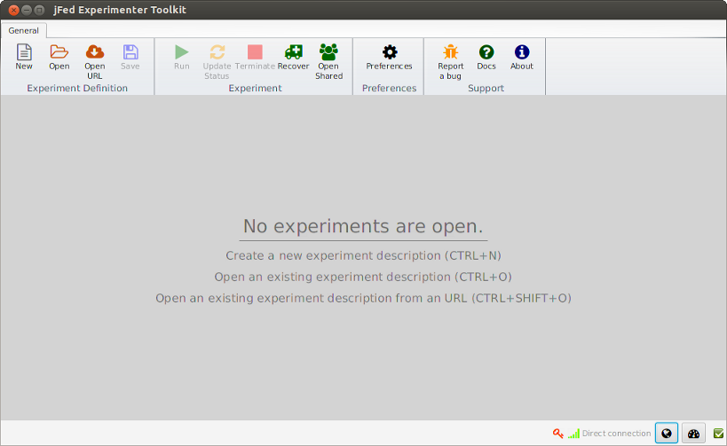
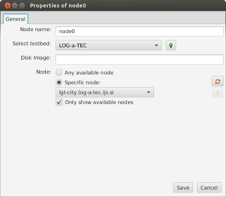
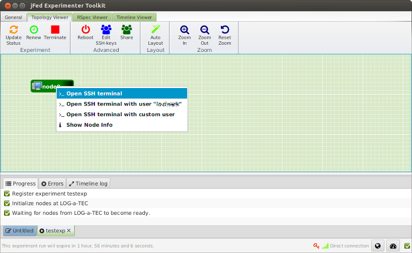
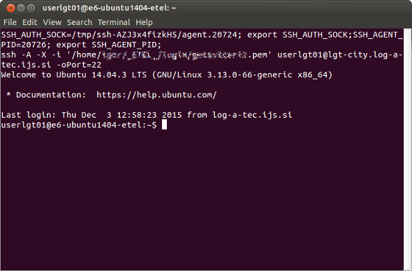
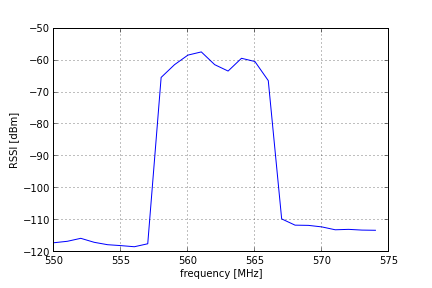
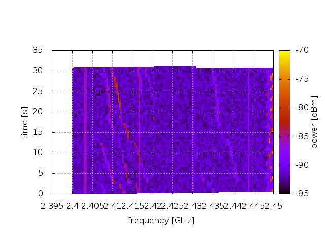

<!-- vim: linebreak filetype=markdown expandtab ts=4 sw=4
-->

<meta charset="utf-8">

[TOC]

# Fed4FIRE LOG-a-TEC Tutorial

This tutorial shows the basic steps required to develop, run and retrieve the results of simple radio experiments on the LOG-a-TEC testbed. It describes how to establish a terminal session with the Sensor Cluster Controller and how to use the terminal session to run an experiment directly from the command line or from an OMF Experiment Controller. Through several working examples it then demonstrates how you can write Python scripts that communicate with the individual nodes and control the experimental radio hardware in the testbed using the ALH protocol. Where necessary, it provides links to more in-depth LOG-a-TEC documentation and other resources on the web.

The tutorial assumes that:

 * you know how to create and edit text files from the Linux command line,
 * you are familiar with the basics of the Python programming language (otherwise see [The Python Tutorial](https://docs.python.org/2/tutorial/)),
 * you know the basic concepts of the LOG-a-TEC testbed (testbed clusters, coordinators, nodes and radios - otherwise see [LOG-a-TEC overview](cr.html)),
 * you have a web browser capable of running the jFed Experimenter GUI and
 * you have a Fed4FIRE User Certificate and the certificate password (otherwise see [Fed4FIRE tutorials page](http://www.fed4fire.eu/tutorials/)).

## Part 1: Establish a SSH terminal session to a Sensor Cluster Controller (SCC) 

### Getting a Fed4FIRE account and certificate
The [LOG-a-TEC](cr.html) testbed is a member of the [Fed4FIRE](http://www.fed4fire.eu/) federation of testbeds. To access it using the Fed4FIRE tools, the user needs a Fed4FIRE account and certificate. More information about how to obtain it can be found on the Fed4FIRE [tutorials](http://www.fed4fire.eu/tutorials/) page.
 
### SFA client tools - jFed Tools
The Fed4FIRE testbed federation is based on SFA (Slice-Based Federation Architecture). SFA-compatible client tools are needed to access and use the Fed4FIRE testbeds. The [jFed](http://jfed.iminds.be/) tools are a set of SFA-compatible tools supporting testbed users (experimenters) as well as developers. The tools are available with GUI (Graphical User Interface) as well as CLI (Command Line Interface).

### Using jFED Experimenter GUI for conducting experiments

To prepare and conduct a testbed experiment, go to the [jFed](http://jfed.iminds.be/) web page and start jFed Experimenter Toolkit (jFED Experimenter GUI) by pressing `Quickstart Experimenter GUI`. In the login window, you must fill in the path to your Fed4FIRE `User certificate` and the certificate `Password`.

Next, click `New` to start defining your new experiment.

Drag `Generic Node` to the drawing board. This will represent a SCC (Sensor Cluster Controller) node. Generally, the graphical editor can be used to place multiple nodes and their interconnections. However, in the LOG-a-TEC case, only a single SCC node is normally defined and used to access the corresponding sensor cluster. Right click the just created node on the drawing board and click `Configure Node`. 

Select the `LOG-a-TEC testbed`, `Specific node`, and then one of the available SCC nodes (`lgt-city.log-a-tec-ijs.si` or `lgt-industrial.log-a-tec-ijs.si`), and `Save`.

Press `Run` in the main window.

This opens a window, where you fill in a name for of your experiment. You can enter the name of your project (registered with your LOG-a-TEC account), or proceed by deselecting `Project`. Click `Start Experiment`.

Wait until the experiment and the node get ready (the node color turns green). Right click the node and click `Open SSH terminal`.

This opens as SSH terminal session on the Sensor Cluster Controller, which is used to prepare and conduct your sensor cluster experiment, as described in the following parts of this tutorial.

You can open a new SSH terminal session to this node anytime during the lifetime of your experiment, while the node is reserved (provided), with your and your public key installed.

When your reservation period expires or you manually release the resources, any open SSH terminal session is automatically terminated and your public key is uninstalled.

When the node is not provided for you, your public key is not installed. The login will then ask for password (which is not available to the users) and you will not be able to access the node.

## Part 2: Running scripts on the SCC

### Writing a "Hello World" experiment

Before showing how to run an experiment on the test bed we first need an experiment to run. In this tutorial we will use Python scripts to control our experiments. We will dive deeper into the possibilities offered by the Python scripting in the later parts of the tutorial. However, in this example we will only establish a connection with the cluster coordinator and query its `hello` resource. The `hello` resource simply returns the version of the coordinator's firmware. This demonstrates the basic usage of the Python library to perform ALH GET requests and serves as a minimal script that tests the communication with the testbed.

Log into the Sensor Cluster Controller and save the following script into a file named `01-hello.py`:

    # We use "logging" module from the standard library for writing out useful
    # debugging information.
    import logging

    # We also import the "vesna.omf" module. This module provides the
    # integration between the ALH protocol and the OMF ecosystem.
    import vesna.omf

    def main():
        # Set up logging to show informational messages. It's often useful to
        # see what is going on behind the scenes.
        logging.basicConfig(level=logging.INFO)

        # By creating an instance of the vesna.omf.ALH class, we connect to the
        # cluster coordinator. Instances of the ALH class (and its subclasses
        # as we will see later) are our abstractions of the nodes in the
        # testbed.
        coordinator = vesna.omf.ALH()

        # Here we execute a GET request for the "hello" resource on the
        # coordinator and print the response.
        print coordinator.get("hello")

    main()

Reference documentation for classes and methods from the Python library is [accessible on-line](https://vesna-alh-tools.readthedocs.org/en/latest/) or from the SSC terminal using the `pydoc` tool.

For example, to look up documentation for the `vesna.omf.ALH` class, use:

    pydoc vesna.omf.ALH

Further reading:

 * For a description of the underlying protocol, see [testbed access using ALH protocol](cr-software.html#testbed-access-using-alh-protocol).
 * Source of the Python library is available [on GitHub](https://github.com/avian2/vesna-alh-tools).

### Running with OMF

OMF is a control, measurement and management framework for testbeds. It provides a standardized way to describe an experiment, execute it and collect its results and is used across the Fed4Fire federation.

Running your experiment with OMF is the preferred way if you are already familiar with OMF or you want to combine your experiment with resources other than nodes in the LOG-a-TEC testbed.

To run an experiment using OMF, we first need to create the Experiment Description (ED) using the OMF Experiment Description Language (OEDL). Since our Hello World experiment only uses the LOG-a-TEC cluster, the corresponding ED is relatively simple. Save the following as `01-hello.rb`:

    # Define a property that contains the name of the cluster we will be using
    # for this experiment. We will set this property later from the
    # command-line using the "--cluster" option.
    defProperty("cluster", "unconfigured-cluster", "ID of a cluster")

    # Define a group of OMF resources that we will be using in the experiment.
    # Here, the group has only one resource - the LOG-a-TEC cluster we defined
    # through the property above.
    defGroup("Actor", property.cluster)

    # When all our OMF resources are ready...
    onEvent(:ALL_UP) do |event|
      # execute the "01-hello.py" Python script using the resources in group
      # Actor. The script is located in the same directory as the ED.
      path = File.join(File.dirname(__FILE__), "01-hello.py")
      group("Actor").exec("python #{path}")
    end

    # Finally, when the OMF signals that our script has exited, declare the
    # experiment finished.
    onEvent(:ALL_APPS_DONE) do |event|
      Experiment.done
    end

We also need a configuration file for the OMF Experiment Controller (EC). Save the following as `config.yml`. This simple configuration file reduces the amount of debugging information printed by OMF to the screen and instructs the Experiment Controller to save its log file into the current directory:

    logging:
      appenders:
        stdout:
          level: :info
        rolling_file:
          log_dir: .

Finally, we can run our experiment. Enter the following on the command line (if you reserved a cluster other than `lgt-industrial` (LOG-a-TEC industrial zone), change the value of the `--cluster` option accordingly):

    omf_ec -c config.yml 01-hello.rb -- --cluster lgt-industrial

This should produce output similar to the following:

    INFO	OML4R Client 2.10.6 [OMSPv4; Ruby 1.9.3] Copyright 2009-2014, NICTA
    Warning: OML4R: Missing values for parameter :domain (--oml-domain, OML_DOMAIN)! to instrument, so it will run without instrumentation. (see --oml-help)
    13:11:30  INFO OmfEc::Runner: OMF Experiment Controller 6.2.2 - Start
    13:11:30  INFO OmfEc::Runner: Connected using {:proto=>:amqp, :user=>"guest", :domain=>"127.0.0.1"}
    13:11:30  INFO OmfEc::Runner: Execute: /home/userlgt02/01-hello.rb
    13:11:30  INFO OmfEc::Runner: Properties: {:cluster=>"lgt-industrial"}
    13:11:30  INFO OmfEc::ExperimentProperty: cluster = "lgt-industrial" (String)
    13:11:30  INFO OmfEc::Experiment: Experiment: 2015-12-07T12:11:30.504Z starts
    13:11:30  INFO OmfEc::Experiment: CONFIGURE 1 resources to join group Actor
    13:11:30  INFO OmfEc::Experiment: TOTAL resources: 1. Events check interval: 1.
    13:11:31  INFO OmfEc::Experiment: Event triggered: 'ALL_NODES_UP, ALL_UP'
    13:11:32  INFO OmfEc::Experiment: Event triggered: 'Actor_application_cfea7351-2a06-481e-8e20-6695e77cc069_created'
    13:11:32  INFO OmfEc: APP_EVENT STARTED from app cfea7351-2a06-481e-8e20-6695e77cc069-ac421ce0-19db-451c-ad1c-5cec9a3d3bcf - msg: env -i CLUSTER_UID='lgt-industrial' python /home/userlgt02/01-hello.py 
    13:11:39  INFO OmfEc: APP_EVENT STDERR from app cfea7351-2a06-481e-8e20-6695e77cc069-ac421ce0-19db-451c-ad1c-5cec9a3d3bcf - msg: INFO:vesna.alh:     GET: hello?
    13:11:39  INFO OmfEc: APP_EVENT STDERR from app cfea7351-2a06-481e-8e20-6695e77cc069-ac421ce0-19db-451c-ad1c-5cec9a3d3bcf - msg: INFO:vesna.alh:response: Coordinator version 2.45
    13:11:39  INFO OmfEc: APP_EVENT STDOUT from app cfea7351-2a06-481e-8e20-6695e77cc069-ac421ce0-19db-451c-ad1c-5cec9a3d3bcf - msg: Coordinator version 2.45
    13:11:39  INFO OmfEc: APP_EVENT STDOUT from app cfea7351-2a06-481e-8e20-6695e77cc069-ac421ce0-19db-451c-ad1c-5cec9a3d3bcf - msg: 
    13:11:39  INFO OmfEc: APP_EVENT EXIT from app cfea7351-2a06-481e-8e20-6695e77cc069-ac421ce0-19db-451c-ad1c-5cec9a3d3bcf - msg: 0
    13:11:39  INFO OmfEc::Experiment: Event triggered: 'ALL_APPS_DONE'
    13:11:39  INFO OmfEc::Experiment: Experiment: 2015-12-07T12:11:30.504Z finished
    13:11:39  INFO OmfEc::Experiment: Exit in 15 seconds...
    13:11:50  INFO OmfEc::Experiment: Configure resources to leave Actor
    13:11:53  INFO OmfEc::Experiment: OMF Experiment Controller 6.2.2 - Exit.

The result of our `print` statement in the Python script is on this line:

    13:11:39  INFO OmfEc: APP_EVENT STDOUT from app cfea7351-2a06-481e-8e20-6695e77cc069-ac421ce0-19db-451c-ad1c-5cec9a3d3bcf - msg: Coordinator version 2.45

You can also see raw traffic over the ALH protocol in the preceeding lines that contain `INFO:vesna.alh`. These lines can be useful later when you will be developing more complicated experiments - they show the exact requests that were sent to the testbed.

    13:11:39  INFO OmfEc: APP_EVENT STDERR from app cfea7351-2a06-481e-8e20-6695e77cc069-ac421ce0-19db-451c-ad1c-5cec9a3d3bcf - msg: INFO:vesna.alh:     GET: hello?
    13:11:39  INFO OmfEc: APP_EVENT STDERR from app cfea7351-2a06-481e-8e20-6695e77cc069-ac421ce0-19db-451c-ad1c-5cec9a3d3bcf - msg: INFO:vesna.alh:response: Coordinator version 2.45

Further reading:

 * [OMF 6 Documentation](https://omf.mytestbed.net/projects/omf6/wiki/Wiki)

### Running without OMF

For simple experiments that only access the LOG-a-TEC testbed nodes from a
Python script, running the script directly without OMF can be simpler.

To run our `01-hello.py` script directly, enter the following on the command line (if you reserved a cluster other than `lgt-industrial` (LOG-a-TEC industrial zone), change the value of the `CLUSTER_UID` variable):

    CLUSTER_UID=lgt-industrial python 01-hello.py

This should produce output similar to the following:

    INFO:vesna.alh:     GET: hello?
    INFO:vesna.alh:response: Coordinator version 2.45
    Coordinator version 2.45

Similar to the OMF example, what you see on the screen includes both the output of our `print` statement (the last line) and the debugging output produced by the `vesna.alh` module (preceeding lines starting with `INFO:vesna.alh`).

## Part 3: Controlling the testbed nodes from SCC

### Accessing individual nodes

From the SCC we can only directly perform requests on the cluster coordinator. The coordinator itself does not have any resources for experimentation. Its only purpose is to forward our requests over the wireless management network to the testbed nodes using the ALH protocol.

The Python library allows you to conveniently hide the fact that you are talking to nodes through the coordinator. The following example demonstrates this by reading the temperature sensor from one of the nodes in the testbed.

*A note about node addresses used in these examples*: nodes in different clusters use different addresses, so an example written for the city center cluster will not work on the industrial zone cluster without modification and vice-versa. If you are using a cluster different from the one the example was written for, you should select nodes from your cluster and correct the addresses in the script accordingly.

Save the following as `02-proxy.py`:

    # This example shows how to perform a "GET sensor/mcuTemp" request on a sensor
    # node 19 in the industrial zone cluster using the coordinator as a proxy.

    import logging
    import vesna.omf
    import vesna.alh

    def main():
        logging.basicConfig(level=logging.INFO)

        # Establish a connection with the coordinator and return an instance of
        # the vesna.omf.ALH class.
        coordinator = vesna.omf.ALH()

        # Establish a connection with the sensor node 19 by proxying requests
        # through the coordinator. We do this by creating an instance of the
        # vesna.alh.ALHProxy object. This object supports GET and POST requests
        # in the same way as the coordinator object.
        node19 = vesna.alh.ALHProxy(coordinator, 19)

        # Request a value from the integrated temperature sensor by performing
        # a GET request for the "sensor/mcuTemp" resource and print the
        # response.
        print node19.get("sensor/mcuTemp")

    main()

Run the script from the command-line:

    CLUSTER_UID=lgt-industrial python 02-proxy.py

This should produce output similar to the following:

    INFO:vesna.alh:     GET: nodes?19/sensor/mcuTemp?
    INFO:vesna.alh:response: MCU temperature is 41.8 C
    NOT CALIBRATED!

    MCU temperature is 41.8 C
    NOT CALIBRATED!

All nodes in the LOG-a-TEC testbed clusters have such a temperature sensor. However, the sensors are usually not calibrated and the temperature reading might have a significant error.

Further reading:

 * For a description of the underlying protocol, see [testbed access using ALH protocol](cr-software.html#testbed-access-using-alh-protocol).

### Querying the installed radio configuration

Different nodes in the testbed have different radio hardware installed. Each radio hardware supports a number of spectrum sensing and signal generation configurations. You can query these from your script by requesting the `sensing/deviceConfigList` and `generator/deviceConfigList` resources. The following example shows how to perform such a request on a node in the LOG-a-TEC industrial zone that is equipped with the SNE-ISMTV-TI24 radio (based on the Texas Instrument CC2500 transceiver).

Save the following as `03-query.py`:

    import vesna.omf
    import vesna.alh

    def main():
        # Connect to node 25.
        addr = 25
        coor = vesna.omf.ALH()
        node = vesna.alh.ALHProxy(coor, addr)

        print "Spectrum sensing configurations for node %d:" % (addr,)
        print node.get("sensing/deviceConfigList")

        print "Signal generation configurations for node %d:" % (addr,)
        print node.get("generator/deviceConfigList")

    main()

Run the script from the command-line:

    CLUSTER_UID=lgt-industrial python 03-query.py

This should produce output similar to the following. Note that since we did not configure the logging library, the raw ALH requests are not printed in this example.

    Spectrum sensing configurations for node 25:
    dev #0, CC2500, 4 configs:
      cfg #0: CC2500, f_c=2400 MHz, BW=400 kHz, 10 samples averaged:
         base: 2399999908 Hz, spacing: 399628 Hz, bw: 421875 Hz, channels: 255, time: 30 ms
      cfg #1: CC2500, f_c=2400 MHz, BW=400 kHz, no averaging:
         base: 2399999908 Hz, spacing: 399628 Hz, bw: 421875 Hz, channels: 255, time: 30 ms
      cfg #2: CC2500, f_c=2400 MHz, BW=60 kHz:
         base: 2399999908 Hz, spacing: 399628 Hz, bw: 60268 Hz, channels: 255, time: 30 ms
      cfg #3: CC2500, f_c=2400 MHz, BW=800 kHz, df=5MHz, ZigBee:
         base: 2404999987 Hz, spacing: 5000278 Hz, bw: 843681 Hz, channels: 15, time: 30 ms

    Signal generation configurations for node 25:
    dev #0, CC2500, 1 configs:
      cfg #0: CC2500, 2.4 GHz, 200 kHz channels:
         base: 2399999908 Hz, spacing: 199814 Hz, bw: 210938 Hz, channels: 256, min power: -55 dBm, max power: 0 dBm, time: 5 ms

This output tells you that node 25 has:

 * one hardware spectrum sensing device installed with name `CC2500` and numerical ID 0 that supports 4 pre-set configuations:
    * configuration with ID 0 is called `CC2500, f_c=2400 MHz, BW=400 kHz, 10 samples averaged` and has:
        * base frequency 2.399999908 GHz (i.e. frequency of channel 0),
        * channel spacing 399.628 kHz,
        * channel filter bandwidth 421.875,
        * 255 channels and
        * takes 30 ms to sense RSSI in a channel.
    * configuration with ID 1 is called `CC2500, f_c=2400 MHz, BW=400 kHz, no averaging`, etc.
 * one hardware signal generation device installed with name `CC2500` and numerical id 0 that supports 1 pre-set configuration:
    * configuration with ID 0 is called `CC2500, 2.4 GHz, 200 kHz channels` and has
        * base frequency 2.399999908 GHz (i.e. frequency of channel 0),
        * channel spacing 199.814 kHz,
        * transmission bandwidth 210.938 kHz,
        * 256 channels,
        * minimum transmission power -55 dBm,
        * maximum transmission power 0 dBm and
        * takes 5 ms to change the channel.

Further reading:

 * For a description of radio hardware, see [hardware components](cr-hardware.html).

### Performing simple RSSI spectrum sensing

Spectrum sensing devices on board the testbed nodes can be used to measure power spectral density. The following example uses node 19 in the industrial zone cluster to observe the DVB-T multiplex transmitted from the local broadcast tower at 562 MHz.

The `vesna.alh` Python module provides a convenient `SpectrumSensor` class that further abstracts the spectrum sensing functions. This way you no longer need to perform individual ALH GET and POST requests - they are done automatically for you when you call `SpectrumSensor` methods. However, if you enable logging you can still see the exact sequence of requests that go to the testbed.

Save the following as `04-sweep.py`:

    import logging
    import vesna.alh
    import vesna.omf

    from vesna.alh.spectrumsensor import SpectrumSensor

    import numpy as np

    def main():
        logging.basicConfig(level=logging.INFO)

        # Connect to node 19. Node 19 is equipped with an UHF receiver
        # (TDA18219 on SNE-ISMTV-UHF) that is capable of RSSI sensing on the
        # DVB-T broadcast band.
        coor = vesna.omf.ALH()
        node = vesna.alh.ALHProxy(coor, 19)

        # Wrap an ALHProxy object with a SpectrumSensor object that provides an
        # convenient interface to spectrum sensing functionality.
        sensor = SpectrumSensor(node)

        # Get a ConfigList object that contains a list of device configurations
        # supported by the chosen sensor node. This performs the
        # "sensing/deviceConfigList" request we saw in the earlier example.
        config_list = sensor.get_config_list()

        # ConfigList.get_sweep_config() method will automatically choose
        # the best device and configuration that can cover the requested
        # frequency range.
        #
        # It returns an instance of SweepConfig class that describes all
        # the settings for a frequency sweep.
        #
        # This example defines a sweep starting at 550 MHz and ending at
        # 574 MHz with 1 MHz steps
        sweep_config = config_list.get_sweep_config(550e6, 574e6, 1e6)

        sweep = sensor.sweep(sweep_config)

        # We save the result of the sweep into two ASCII-formatted files:
        # The first file contains the measured RSSI values in dBm and
        np.savetxt('04-sweep.power_dbm.out', sweep.data)
        # the second file contains the central frequencies of each measured
        # channel in Hz.
        np.savetxt('04-sweep.freq_hz.out', sweep_config.get_hz_list())

    main()

Run the script from the command-line:

    CLUSTER_UID=lgt-industrial python 04-sweep.py

This should produce output similar to the following:

    INFO:vesna.alh:     GET: nodes?19/sensing/deviceConfigList?
    INFO:vesna.alh:response: dev #0, TDA18219, 2 configs:
      cfg #0: DVB-T 1.7 MHz:
         base: 470000000 Hz, spacing: 1000 Hz, bw: 1700000 Hz, channels: 392000, time: 50 ms
      cfg #1: DVB-T 8.0 MHz:
         base: 470000000 Hz, spacing: 1000 Hz, bw: 8000000 Hz, channels: 392000, time: 50 ms
    INFO:vesna.alh:    POST: nodes?19/sensing/quickSweepBin?
    INFO:vesna.alh:    DATA: dev 0 conf 0 ch 80000:1000:96000
    INFO:vesna.alh:unprintable response (52 bytes)
    INFO:vesna.alh:    POST: nodes?19/sensing/quickSweepBin?
    INFO:vesna.alh:    DATA: dev 0 conf 0 ch 96000:1000:104001
    INFO:vesna.alh:unprintable response (38 bytes)

You can see from this output that the node was first queried for its available configurations using the `sensing/deviceConfigList` resource and then instructed to sweep channels 80000 through 104000 with step 1000 using device ID 0 and configuration id 0 using the `sensing/quickSweepBin` resource.

From the response to the `sensing/deviceConfigList`, we can calculate that channel 80000 corresponds to 550 MHz (470 MHz + 80000 * 1 kHz) and channel 104000 to 574 MHz (470 MHz + 104000 * 1 kHz), which are the limits of the sweep we defined in our script. Device configuration 0 has nominal channel filter bandwidth of 1700 kHz, which defines the resolution bandwidth of our measurement.

If you plot the two resulting ASCII-formatted files, the resulting graph should look similar to the following:

The OFDM-modulated DVB-T multiplex with the center frequency of 562 MHz and bandwidth of 8 MHz can be clearly seen.

### Transmitting a signal

Instructing nodes from the Python script to generate a RF signal is very similar to spectrum sensing. Note however that not all radios can be used to transmit (for example, the SNE-ISMTV-UHF radio in the previous example is receive only). In this example, we use the CC2500 transceiver on the node 25 in the industrial zone to transmit a signal in the 2.4 GHz ISM band.

Similarly to the `SpectrumSensor` class, the `vesna.alh.SignalGenerator` Python module provides a convenient abstraction of the signal generation functions exposed through the ALH protocol.

This example also introduces the concept of programming a node to independently execute instructions at the predetermined time. This functionality can be used to construct complex pre-defined scenarios where one or multiple nodes start and stop transmitting in required patterns. For this purpose the `SignalGeneratorProgram` class is used.

Save the following as `05-transmit.py`:

    import logging
    import time
    import vesna.omf
    import vesna.alh

    from vesna.alh.signalgenerator import SignalGenerator, SignalGeneratorProgram

    def main():
        logging.basicConfig(level=logging.INFO)

        # Connect to node 25
        coor = vesna.omf.ALH()
        node = vesna.alh.ALHProxy(coor, 25)

        # We wrap the ALHProxy object with a SignalGenerator object that
        # provides a convenient interface to the signal generation
        # functionality.
        generator = SignalGenerator(node)

        # Get a ConfigList object that contains a list of device configurations
        # supported by the chosen transmitter node.
        config_list = generator.get_config_list()

        # ConfigList.get_tx_config() method will automatically choose
        # a device and hardware configuration that can be used to transmit on
        # the requested frequency. It returns an instance of TxConfig class
        # that describes all settings for signal generation.
        #
        # We request a transmission at 2.425 GHz with 0 dBm.
        tx_config = config_list.get_tx_config(2425e6, 0)

        # SignalGeneratorProgram object joins the transmit config with timing
        # information. Here we specify that we want to start the transmission 5
        # seconds from now and that the transmission should be 30 seconds long.
        now = time.time()
        program = SignalGeneratorProgram(tx_config, now + 5, 30)

        generator.program(program)

    main()

Run the script from the command-line:

    CLUSTER_UID=lgt-industrial python 05-transmit.py

This should produce output similar to the following:

    INFO:vesna.alh:     GET: nodes?25/generator/deviceConfigList?
    INFO:vesna.alh:response: dev #0, CC2500, 1 configs:
      cfg #0: CC2500, 2.4 GHz, 200 kHz channels:
         base: 2399999908 Hz, spacing: 199814 Hz, bw: 210938 Hz, channels: 256, min power: -55 dBm, max power: 0 dBm, time: 5 ms
    INFO:vesna.alh:    POST: nodes?25/generator/program?
    INFO:vesna.alh:    DATA: in 4 sec for 30 sec with dev 0 conf 0 channel 125 power 0
    INFO:vesna.alh:response: Node #25 return;

### Programming spectrum sensing in advance

In this example, we program a spectrum sensing task in advance. Compared to simple sensing we did in one of the previous examples, programmed tasks can include multiple sweeps. Data from these sweeps is stored on board the sensor node and can be later retrieved via the wireless management network.

Save the following as `06-program.py`:

    import logging
    import time
    import vesna.omf
    import vesna.alh

    from vesna.alh.spectrumsensor import SpectrumSensor, SpectrumSensorProgram

    def main():
        logging.basicConfig(level=logging.INFO)

        # Connect to node 2
        coor = vesna.omf.ALH()
        node = vesna.alh.ALHProxy(coor, 2)

        # We set up a frequency sweep configuration covering 2.40 GHz to 2.45
        # GHz band with 400 kHz steps.
        sensor = SpectrumSensor(node)
        sensor_config_list = sensor.get_config_list()
        sweep_config = sensor_config_list.get_sweep_config(2400e6, 2450e6, 400e3)

        # Take note of current time.
        now = time.time()

        # SpectrumSensorProgram objects allow us to program spectrum sensing
        # tasks in advance.
        #
        # In this case, we setup a spectrum sensing task using frequency sweep
        # we prepared above starting 5 seconds from now and lasting for 30
        # seconds. Results of the measurement will be stored in memory slot 4.
        sensor_program = SpectrumSensorProgram(sweep_config, now + 5, 30, 4)

        # Now actually send instructions over the management network the node
        # in the testbed.
        sensor.program(sensor_program)

        # Query the spectrum sensing node and wait until the task has been
        # completed.
        while not sensor.is_complete(sensor_program):
            print "waiting..."
            time.sleep(2)

        # Retrieve spectrum sensing results. This might take a while since the
        # management mesh network is slow.
        result = sensor.retrieve(sensor_program)

        # Write results into a CSV file.
        result.write("06-program.out")

    main()

Run the script from the command-line:

    CLUSTER_UID=lgt-industrial python 06-program.py

This should produce output similar to the following:

    INFO:vesna.alh:     GET: nodes?2/sensing/deviceConfigList?
    INFO:vesna.alh:response: dev #0, CC2500, 4 configs:
      cfg #0: CC2500, f_c=2400 MHz, BW=400 kHz, 10 samples averaged:
         base: 2399999908 Hz, spacing: 399628 Hz, bw: 421875 Hz, channels: 255, time: 30 ms
      cfg #1: CC2500, f_c=2400 MHz, BW=400 kHz, no averaging:
         base: 2399999908 Hz, spacing: 399628 Hz, bw: 421875 Hz, channels: 255, time: 30 ms
      cfg #2: CC2500, f_c=2400 MHz, BW=60 kHz:
         base: 2399999908 Hz, spacing: 399628 Hz, bw: 60268 Hz, channels: 255, time: 30 ms
      cfg #3: CC2500, f_c=2400 MHz, BW=800 kHz, df=5MHz, ZigBee:
         base: 2404999987 Hz, spacing: 5000278 Hz, bw: 843681 Hz, channels: 15, time: 30 ms
    INFO:vesna.alh:    POST: nodes?2/sensing/freeUpDataSlot?id=4
    INFO:vesna.alh:response: Node #2 return;
    INFO:vesna.alh:    POST: nodes?2/sensing/program?
    INFO:vesna.alh:    DATA: in 4 sec for 30 sec with dev 0 conf 0 ch 0:1:126 to slot 4
    INFO:vesna.alh:response: Node #2 return;1. absStart = 4, absEnd = 30, now = 1337510069
    1. absStart = 1337510073, absEnd = 1337510103, now = 1337510069
    currentLine = 'in 4 sec for 30 sec with dev 0 conf 0 ch 0:1:126 to slot 4'
    waiting...
    waiting...
    waiting...
    waiting...
    waiting...
    waiting...
    waiting...
    waiting...
    waiting...
    waiting...
    waiting...
    waiting...
    waiting...
    waiting...
    waiting...
    waiting...
    waiting...
    INFO:vesna.alh:     GET: nodes?2/sensing/slotInformation?id=4
    INFO:vesna.alh:response: size=12960
    version=1337508956
    status=INCOMPLETE
    crc=682689476
    waiting...
    INFO:vesna.alh:     GET: nodes?2/sensing/slotInformation?id=4
    INFO:vesna.alh:response: size=12960
    version=1337510103
    status=COMPLETE
    crc=881766339
    INFO:vesna.alh:     GET: nodes?2/sensing/slotInformation?id=4
    INFO:vesna.alh:response: size=12960
    version=1337510103
    status=COMPLETE
    crc=881766339
    INFO:vesna.alh:     GET: nodes?2/sensing/slotDataBinary?id=4&start=0&size=512
    INFO:vesna.alh:unprintable response (516 bytes)
    INFO:vesna.alh:     GET: nodes?2/sensing/slotDataBinary?id=4&start=512&size=512
    INFO:vesna.alh:unprintable response (516 bytes)
    INFO:vesna.alh:     GET: nodes?2/sensing/slotDataBinary?id=4&start=1024&size=512
    INFO:vesna.alh:unprintable response (516 bytes)
    INFO:vesna.alh:     GET: nodes?2/sensing/slotDataBinary?id=4&start=1536&size=512
    INFO:vesna.alh:unprintable response (516 bytes)
    INFO:vesna.alh:     GET: nodes?2/sensing/slotDataBinary?id=4&start=2048&size=512
    INFO:vesna.alh:unprintable response (516 bytes)
    INFO:vesna.alh:     GET: nodes?2/sensing/slotDataBinary?id=4&start=2560&size=512
    INFO:vesna.alh:unprintable response (516 bytes)
    INFO:vesna.alh:     GET: nodes?2/sensing/slotDataBinary?id=4&start=3072&size=512
    INFO:vesna.alh:unprintable response (516 bytes)
    INFO:vesna.alh:     GET: nodes?2/sensing/slotDataBinary?id=4&start=3584&size=512
    INFO:vesna.alh:unprintable response (516 bytes)
    INFO:vesna.alh:     GET: nodes?2/sensing/slotDataBinary?id=4&start=4096&size=512
    INFO:vesna.alh:unprintable response (516 bytes)
    INFO:vesna.alh:     GET: nodes?2/sensing/slotDataBinary?id=4&start=4608&size=512
    INFO:vesna.alh:unprintable response (516 bytes)
    INFO:vesna.alh:     GET: nodes?2/sensing/slotDataBinary?id=4&start=5120&size=512
    INFO:vesna.alh:unprintable response (516 bytes)
    INFO:vesna.alh:     GET: nodes?2/sensing/slotDataBinary?id=4&start=5632&size=512
    INFO:vesna.alh:unprintable response (516 bytes)
    INFO:vesna.alh:     GET: nodes?2/sensing/slotDataBinary?id=4&start=6144&size=512
    INFO:vesna.alh:unprintable response (516 bytes)
    INFO:vesna.alh:     GET: nodes?2/sensing/slotDataBinary?id=4&start=6656&size=512
    INFO:vesna.alh:unprintable response (516 bytes)
    INFO:vesna.alh:     GET: nodes?2/sensing/slotDataBinary?id=4&start=7168&size=512
    INFO:vesna.alh:unprintable response (516 bytes)
    INFO:vesna.alh:     GET: nodes?2/sensing/slotDataBinary?id=4&start=7680&size=512
    INFO:vesna.alh:unprintable response (516 bytes)
    INFO:vesna.alh:     GET: nodes?2/sensing/slotDataBinary?id=4&start=8192&size=512
    INFO:vesna.alh:unprintable response (516 bytes)
    INFO:vesna.alh:     GET: nodes?2/sensing/slotDataBinary?id=4&start=8704&size=512
    INFO:vesna.alh:unprintable response (516 bytes)
    INFO:vesna.alh:     GET: nodes?2/sensing/slotDataBinary?id=4&start=9216&size=512
    INFO:vesna.alh:unprintable response (516 bytes)
    INFO:vesna.alh:     GET: nodes?2/sensing/slotDataBinary?id=4&start=9728&size=512
    INFO:vesna.alh:unprintable response (516 bytes)
    INFO:vesna.alh:     GET: nodes?2/sensing/slotDataBinary?id=4&start=10240&size=512
    INFO:vesna.alh:unprintable response (516 bytes)
    INFO:vesna.alh:     GET: nodes?2/sensing/slotDataBinary?id=4&start=10752&size=512
    INFO:vesna.alh:unprintable response (516 bytes)
    INFO:vesna.alh:     GET: nodes?2/sensing/slotDataBinary?id=4&start=11264&size=512
    INFO:vesna.alh:unprintable response (516 bytes)
    INFO:vesna.alh:     GET: nodes?2/sensing/slotDataBinary?id=4&start=11776&size=512
    INFO:vesna.alh:unprintable response (516 bytes)
    INFO:vesna.alh:     GET: nodes?2/sensing/slotDataBinary?id=4&start=12288&size=512
    INFO:vesna.alh:unprintable response (516 bytes)
    INFO:vesna.alh:     GET: nodes?2/sensing/slotDataBinary?id=4&start=12800&size=160
    INFO:vesna.alh:unprintable response (164 bytes)

Plotting the resulting spectrogram saved in the `06-program.out` file:

