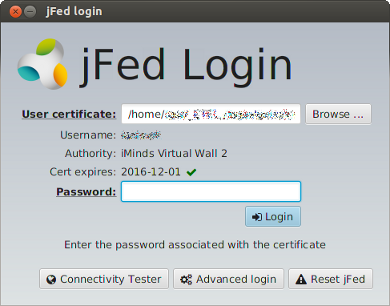
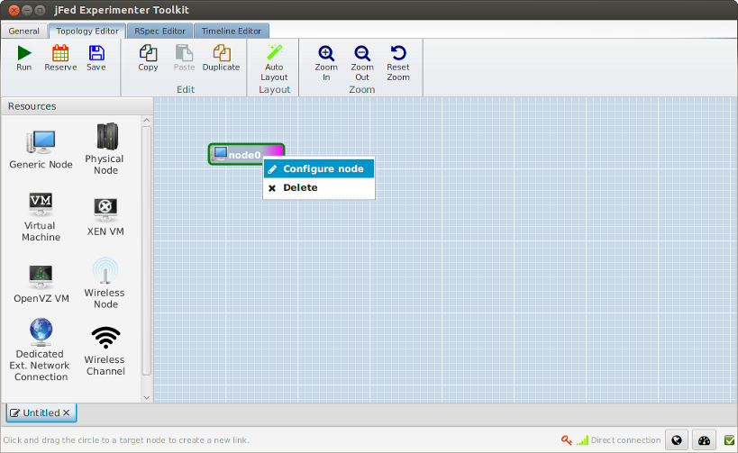
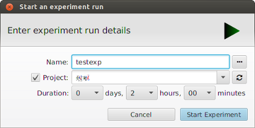

<!-- vim: linebreak filetype=markdown expandtab ts=4 sw=4
-->

<meta charset="utf-8">

[TOC]

# Fed4FIRE LOG-a-TEC Tutorial

This tutorial shows the basic steps required to develop, run and retrieve the results of simple cognitive radio experiments on the LOG-a-TEC testbed. It describes how to establish a terminal session with the Sensor Cluster Controller and how to use the terminal session to run an experiment directly from the command line or from an OMF Experiment Controller. Through several working examples it then demonstrates how you can write Python scripts that communicate with the individual nodes in the testbed using the ALH protocol. Where necessary, it provides links to more in-depth LOG-a-TEC documentation and other resources on the web.

The tutorial assumes that:

 * you know how to create and edit text files from the Linux command line,
 * you are familiar with the basics of the Python programming language (otherwise see [The Python Tutorial](https://docs.python.org/2/tutorial/)),
 * you know the basic concepts of the LOG-a-TEC testbed (testbed clusters, coordinators, nodes and radios - otherwise see [LOG-a-TEC overview](cr.html)),
 * you have a web browser capable of running the jFed Experimenter GUI and
 * you have a Fed4FIRE User Certificate and the certificate password.

## Part 1: Establish a SSH terminal session to a Sensor Cluster Controller (SCC) 

### Getting a Fed4FIRE account and certificate
The [LOG-a-TEC](cr.html) testbed is a member of the [Fed4FIRE](http://www.fed4fire.eu/) federation of testbeds. To access it using the Fed4FIRE tools, the user needs a Fed4FIRE account and certificate. More information about how to obtain it can be found on the Fed4FIRE [tutorials](http://www.fed4fire.eu/tutorials/) page.
 
### SFA client tools - jFed Tools
The Fed4FIRE testbed federation is based on SFA (Slice-Based Federation Architecture). SFA-compatible client tools are needed to access and use the Fed4FIRE testbeds. The [jFed](http://jfed.iminds.be/) tools are a set of SFA-compatible tools supporting testbed users (experimenters) as well as developers. The tools are available with GUI (Graphical User Interface) as well as CLI (Command Line Interface).

### Using jFED Experimenter GUI for conducting experiments

To prepare and conduct a testbed experiment, go to the [jFed](http://jfed.iminds.be/) web page and start jFed Experimenter Toolkit (jFED Experimenter GUI) by pressing `Quickstart Experimenter GUI`. In the login window, you must fill in the path to your Fed4FIRE `User certificate` and the certificate `Password`.

Next, click `New` to start defining your new experiment.

Drag `Generic Node` to the drawing board. This will represent a SCC (Sensor Cluster Controller) node. Generally, the graphical editor can be used to place multiple nodes and their interconnections. However, in the LOG-a-TEC case, only a single SCC node is normally defined and used to access the corresponding sensor cluster. Right click the just created node on the drawing board and click `Configure Node`. 

Select the `LOG-a-TEC testbed`, `Specific node`, and then one of the available SCC nodes (`lgt-city.log-a-tec-ijs.si` or `lgt-industrial.log-a-tec-ijs.si`), and `Save`.

Press `Run` in the main window.

This opens a window, where you fill in a name for of your experiment. You can enter the name of your project (registered with your LOG-a-TEC account), or proceed by deselecting `Project`. Click `Start Experiment`.

Wait until the experiment and the node get ready (the node color turns green). Right click the node and click `Open SSH terminal`.

This opens as SSH terminal session on the Sensor Cluster Controller, which is used to prepare and conduct your sensor cluster experiment, as described in the following parts of this tutorial.

You can open a new SSH terminal session to this node anytime during the lifetime of your experiment, while the node is reserved (provided), with your and your public key installed.

When your reservation period expires or you manually release the resources, any open SSH terminal session is automatically terminated and your public key is uninstalled.

When the node is not provided for you, your public key is not installed. The login will then ask for password (which is not available to the users) and you will not be able to access the node.

## Part 2: Running an experiment on the Sensor Cluster Controller (SCC)

### Writing a "Hello World" experiment

Before showing how to run an experiment on the test bed we first need an experiment to run. In this tutorial we will use Python scripts to control our experiments. We will dive deeper into the possibilities offered by the Python scripting in the later parts of the tutorial. However, in this example we will only establish a connection with the cluster coordinator and query its `hello` resource. The `hello` resource simply returns the version of the coordinator's firmware. This demonstrates the basic usage of the Python library to perform ALH GET requests and serves as a minimal script that tests the communication with the testbed.

Log into the Sensor Cluster Controller and save the following script into a file named `01-hello.py`:

    # We use "logging" module from the standard library for writing out useful
    # debugging information.
    import logging

    # We also import the "vesna.omf" module. This module provides the
    # integration between the ALH protocol and the OMF ecosystem.
    import vesna.omf

    def main():
        # Set up logging to show informational messages. It's always useful to
        # see what is going on behind the scenes.
        logging.basicConfig(level=logging.INFO)

        # By creating an instance of the vesna.omf.ALH class, we connect to the
        # cluster coordinator. Instances of the ALH class (and its subclasses
        # as we will see later) are our abstractions of the nodes in the
        # testbed.
        coordinator = vesna.omf.ALH()

        # Here we execute a GET request for the "hello" resource on the
        # coordinator and print the response.
        print coordinator.get("hello")

    main()

Further reading:

 * For a description of the underlying protocol, see [testbed access using ALH protocol](cr-software.html#testbed-access-using-alh-protocol).

### Running with OMF

OMF is a control, measurement and management framework for testbeds. It provides a standardized way to describe an experiment, execute it and collect its results and is used across the Fed4Fire federation.

Running your experiment with OMF is the preferred way if you are already familiar with OMF or you want to combine your experiment with resources other than nodes in the LOG-a-TEC testbed.

To run an experiment using OMF, we first need to create the Experiment Description (ED) using the OMF Experiment Description Language (OEDL). Since our Hello World experiment only uses the LOG-a-TEC cluster, the corresponding ED is relatively simple. Save the following as `01-hello.rb`:

    # Define a property that contains the name of the cluster we will be using
    # for this experiment. We will set this property later from the
    # command-line using the "--cluster" option.
    defProperty("cluster", "unconfigured-cluster", "ID of a cluster")

    # Define a group of OMF resources that we will be using in the experiment.
    # Here, the group has only one resource - the LOG-a-TEC cluster we defined
    # through the property above.
    defGroup("Actor", property.cluster)

    # When all our OMF resources are ready...
    onEvent(:ALL_UP) do |event|
        # execute the "01-hello.py" Python script using the resources in group
        # Actor. The script is located in the same directory as the ED.
      path = File.join(File.dirname(__FILE__), "01-hello.py")
      group("Actor").exec("python #{path}")
    end

    # Finally, when the OMF signals that our script has exited, declare the
    # experiment finished.
    onEvent(:ALL_APPS_DONE) do |event|
      Experiment.done
    end

We also need a configuration file for the OMF Experiment Controller (EC). Save the following as `config.yml`. This simple configuration file reduces the amount of debugging information printed by OMF to the screen and instructs the Experiment Controller to save its log file into the current directory:

    logging:
      appenders:
        stdout:
          level: :info
        rolling_file:
          log_dir: .

Finally, we can run our experiment. Enter the following on the command line (if you reserved a cluster other than `lgt-industrial` (LOG-a-TEC industrial zone), change the value of the `--cluster` option accordingly):

    omf_ec -c config.yml 01-hello.rb -- --cluster lgt-industrial

This should produce output similar to the following:

    INFO	OML4R Client 2.10.6 [OMSPv4; Ruby 1.9.3] Copyright 2009-2014, NICTA
    Warning: OML4R: Missing values for parameter :domain (--oml-domain, OML_DOMAIN)! to instrument, so it will run without instrumentation. (see --oml-help)
    13:11:30  INFO OmfEc::Runner: OMF Experiment Controller 6.2.2 - Start
    13:11:30  INFO OmfEc::Runner: Connected using {:proto=>:amqp, :user=>"guest", :domain=>"127.0.0.1"}
    13:11:30  INFO OmfEc::Runner: Execute: /home/userlgt02/01-hello.rb
    13:11:30  INFO OmfEc::Runner: Properties: {:cluster=>"lgt-industrial"}
    13:11:30  INFO OmfEc::ExperimentProperty: cluster = "lgt-industrial" (String)
    13:11:30  INFO OmfEc::Experiment: Experiment: 2015-12-07T12:11:30.504Z starts
    13:11:30  INFO OmfEc::Experiment: CONFIGURE 1 resources to join group Actor
    13:11:30  INFO OmfEc::Experiment: TOTAL resources: 1. Events check interval: 1.
    13:11:31  INFO OmfEc::Experiment: Event triggered: 'ALL_NODES_UP, ALL_UP'
    13:11:32  INFO OmfEc::Experiment: Event triggered: 'Actor_application_cfea7351-2a06-481e-8e20-6695e77cc069_created'
    13:11:32  INFO OmfEc: APP_EVENT STARTED from app cfea7351-2a06-481e-8e20-6695e77cc069-ac421ce0-19db-451c-ad1c-5cec9a3d3bcf - msg: env -i CLUSTER_UID='lgt-industrial' python /home/userlgt02/01-hello.py 
    13:11:39  INFO OmfEc: APP_EVENT STDERR from app cfea7351-2a06-481e-8e20-6695e77cc069-ac421ce0-19db-451c-ad1c-5cec9a3d3bcf - msg: INFO:vesna.alh:     GET: hello?
    13:11:39  INFO OmfEc: APP_EVENT STDERR from app cfea7351-2a06-481e-8e20-6695e77cc069-ac421ce0-19db-451c-ad1c-5cec9a3d3bcf - msg: INFO:vesna.alh:response: Coordinator version 2.45
    13:11:39  INFO OmfEc: APP_EVENT STDOUT from app cfea7351-2a06-481e-8e20-6695e77cc069-ac421ce0-19db-451c-ad1c-5cec9a3d3bcf - msg: Coordinator version 2.45
    13:11:39  INFO OmfEc: APP_EVENT STDOUT from app cfea7351-2a06-481e-8e20-6695e77cc069-ac421ce0-19db-451c-ad1c-5cec9a3d3bcf - msg: 
    13:11:39  INFO OmfEc: APP_EVENT EXIT from app cfea7351-2a06-481e-8e20-6695e77cc069-ac421ce0-19db-451c-ad1c-5cec9a3d3bcf - msg: 0
    13:11:39  INFO OmfEc::Experiment: Event triggered: 'ALL_APPS_DONE'
    13:11:39  INFO OmfEc::Experiment: Experiment: 2015-12-07T12:11:30.504Z finished
    13:11:39  INFO OmfEc::Experiment: Exit in 15 seconds...
    13:11:50  INFO OmfEc::Experiment: Configure resources to leave Actor
    13:11:53  INFO OmfEc::Experiment: OMF Experiment Controller 6.2.2 - Exit.

The result of our `print` statement in the Python script is on this line:

    13:11:39  INFO OmfEc: APP_EVENT STDOUT from app cfea7351-2a06-481e-8e20-6695e77cc069-ac421ce0-19db-451c-ad1c-5cec9a3d3bcf - msg: Coordinator version 2.45

You can also see raw traffic over the ALH protocol in the preceeding lines that contain `INFO:vesna.alh`. These lines can be useful later when you will be developing more complicated experiments - they show the exact requests that were sent to the testbed.

    13:11:39  INFO OmfEc: APP_EVENT STDERR from app cfea7351-2a06-481e-8e20-6695e77cc069-ac421ce0-19db-451c-ad1c-5cec9a3d3bcf - msg: INFO:vesna.alh:     GET: hello?
    13:11:39  INFO OmfEc: APP_EVENT STDERR from app cfea7351-2a06-481e-8e20-6695e77cc069-ac421ce0-19db-451c-ad1c-5cec9a3d3bcf - msg: INFO:vesna.alh:response: Coordinator version 2.45

Further reading:

 * [OMF 6 Documentation](https://omf.mytestbed.net/projects/omf6/wiki/Wiki)

### Running without OMF

For simple experiments that only access the LOG-a-TEC testbed nodes from a
Python script, running the script directly without OMF can be simpler.

To run our `01-hello.py` script directly, enter the following on the command line (if you reserved a cluster other than `lgt-industrial` (LOG-a-TEC industrial zone), change the value of the `CLUSTER_UID` variable):

    CLUSTER_UID=lgt-industrial python 01-hello.py

This should produce output similar to the following:

    INFO:vesna.alh:     GET: hello?
    INFO:vesna.alh:response: Coordinator version 2.45
    Coordinator version 2.45

Similar to the OMF example, what you see on the screen includes both the output of our `print` statement (the last line) and the debugging output produced by the `vesna.alh` module (preceeding lines).
